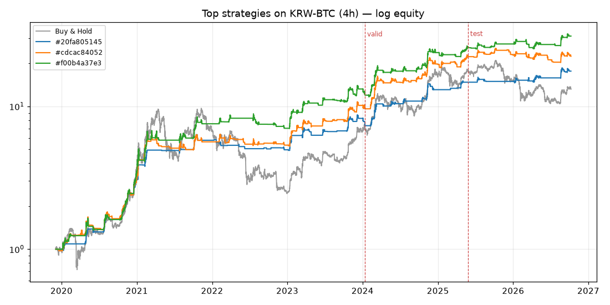

# 🤖 코인 전략 연구 리포트

마지막 업데이트: **2026-10-09** · 대상: KRW-BTC, KRW-ETH, KRW-XRP, KRW-SOL · 봉: 4h

> 학습(앞 60%)으로만 진화 → 검증(다음 20%)으로 입성 심사 → 시험(마지막 20%)은 보고만. '전진'은 전당에 오른 뒤 실제로 새로 쌓인 데이터에서의 성과입니다.

## 오늘
- 데이터: KRW-BTC, KRW-ETH, KRW-XRP, KRW-SOL · 4h · 마지막 봉 2026-10-08 08:00 UTC
- 3037세대 진화, 전략 113,231개 평가
- 새로 명예의 전당 입성: 3개 (검증 구간 B&H 샤프 1.35)

## 명예의 전당

| # | ID | 발견일 | 학습 샤프 | 검증 샤프 | 시험 샤프 | 시험 CAGR | 시험 MDD | 전진 수익 | 전략 |
|---|---|---|---|---|---|---|---|---|---|
| 1 | `20fa805145` | 2026-10-08 | 1.87 | 2.21 | 0.94 | +14.9% | -18.9% | +0.0% (6봉) | 진입: macd_pos(f=16, s=21, sig=7) AND volume_spike(n=37, mult=3.51) | 청산: price_below_ma(n=55, kind=sma) OR ma_cross_down(fast=8, slow=102, kind=sma) | 익절 27.3% |
| 2 | `cdcac84052` 🆕 | 2026-10-09 | 1.71 | 2.35 | 0.48 | +10.6% | -21.9% | - | 진입: price_above_ma(n=26, kind=ema) AND volume_spike(n=28, mult=2.52) | 청산: price_below_ma(n=55, kind=sma) OR ma_cross_down(fast=8, slow=99, kind=sma) | 손절 14.3% / 익절 27.3% / 트레일링 21.4% |
| 3 | `f00b4a37e3` | 2026-10-08 | 2.06 | 1.95 | 0.56 | +11.6% | -29.2% | +0.0% (6봉) | 진입: donchian_break(n=66) AND price_above_ma(n=197, kind=sma) AND volume_spike(n=44, mult=1.334) | 청산: price_below_ma(n=55, kind=sma) OR ma_cross_down(fast=8, slow=102, kind=sma) | 익절 27.3% |
| 4 | `f7e00c6fe8` | 2026-10-08 | 1.86 | 2.10 | 1.21 | +22.2% | -22.0% | +0.0% (6봉) | 진입: donchian_break(n=71) AND price_above_ma(n=197, kind=sma) | 청산: price_below_ma(n=22, kind=ema) | 손절 19.1% / 익절 27.3% / 트레일링 24.5% |
| 5 | `4de1370ec9` | 2026-10-08 | 1.80 | 2.00 | 0.29 | +4.5% | -23.4% | +0.0% (2봉) | 진입: low_volatility(n=43, q=0.24) AND donchian_break(n=16) | 청산: price_below_ma(n=39, kind=ema) | 손절 12.0% |
| 6 | `2439726ead` | 2026-10-08 | 1.71 | 2.07 | 0.62 | +12.3% | -23.7% | +0.0% (3봉) | 진입: donchian_break(n=12) AND volume_spike(n=24, mult=2.89) | 청산: price_below_ma(n=116, kind=sma) |
| 7 | `b12dd3fbc7` 🆕 | 2026-10-09 | 1.72 | 2.03 | 0.65 | +11.8% | -30.1% | - | 진입: donchian_break(n=52) | 청산: price_below_ma(n=42, kind=sma) OR donchian_low_break(n=53) | 익절 33.6% |
| 8 | `90e80c3f19` 🆕 | 2026-10-09 | 1.72 | 2.00 | 0.76 | +14.4% | -27.3% | - | 진입: macd_pos(f=14, s=38, sig=8) AND volume_spike(n=47, mult=2.69) | 청산: price_below_ma(n=58, kind=sma) | 익절 38.6% |
| 9 | `b2a1fb8337` | 2026-10-08 | 1.82 | 1.88 | 0.36 | +6.3% | -28.1% | +0.0% (3봉) | 진입: macd_pos(f=7, s=42, sig=15) AND momentum_pos(n=92, th=0.037) AND volume_spike(n=30, mult=1.36) | 청산: price_below_ma(n=50, kind=sma) |
| 10 | `dcb9037314` | 2026-10-08 | 1.69 | 1.93 | 0.88 | +20.9% | -16.4% | +0.0% (2봉) | 진입: macd_pos(f=7, s=30, sig=15) AND momentum_pos(n=101, th=0.037) AND volume_spike(n=30, mult=1.36) | 청산: price_below_ma(n=22, kind=ema) | 익절 27.3% / 트레일링 28.2% |
| 11 | `f746eeac8f` | 2026-10-08 | 1.71 | 1.90 | 0.58 | +12.2% | -24.2% | +0.0% (2봉) | 진입: donchian_break(n=13) AND low_volatility(n=39, q=0.21) | 청산: price_below_ma(n=38, kind=sma) | 익절 50.6% |
| 12 | `ca0e08a3af` | 2026-10-08 | 1.66 | 1.91 | 0.93 | +13.0% | -18.0% | +0.0% (3봉) | 진입: donchian_break(n=66) AND price_above_ma(n=197, kind=sma) AND volume_spike(n=44, mult=1.334) | 청산: price_below_ma(n=15, kind=sma) OR ma_cross_down(fast=8, slow=102, kind=sma) | 손절 14.3% / 익절 27.3% / 트레일링 21.4% |

비교 기준(단순 보유) 샤프 — 학습 0.96 · 검증 1.35 · 시험 -0.42

샤프·CAGR·MDD는 여러 코인의 중앙값, 수수료 0.05% + 슬리피지 0.05% 반영.
백테스트 성과는 미래 수익을 보장하지 않습니다. 실거래 전에 '전진' 성과가 충분히 쌓였는지 확인하세요.